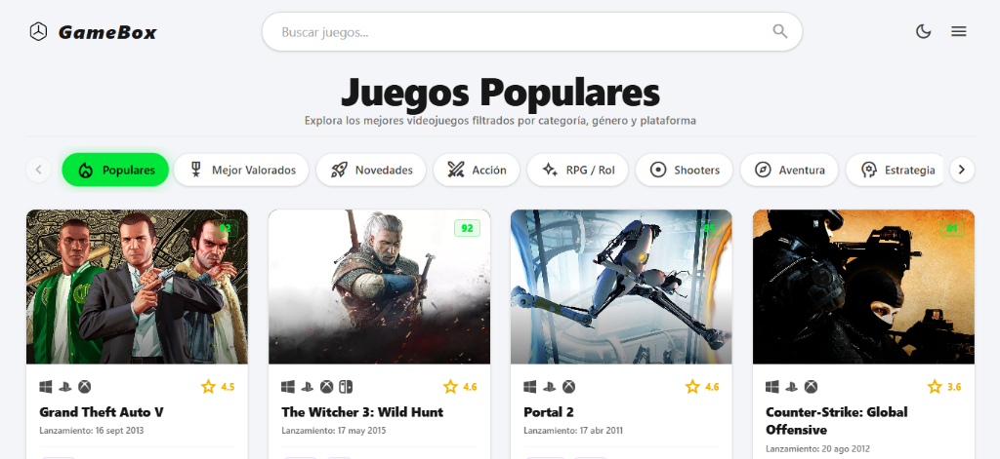
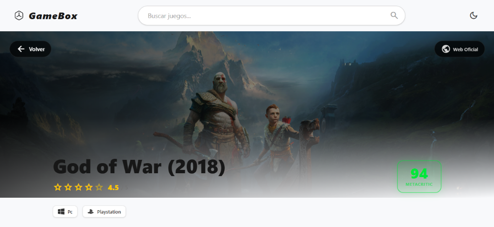
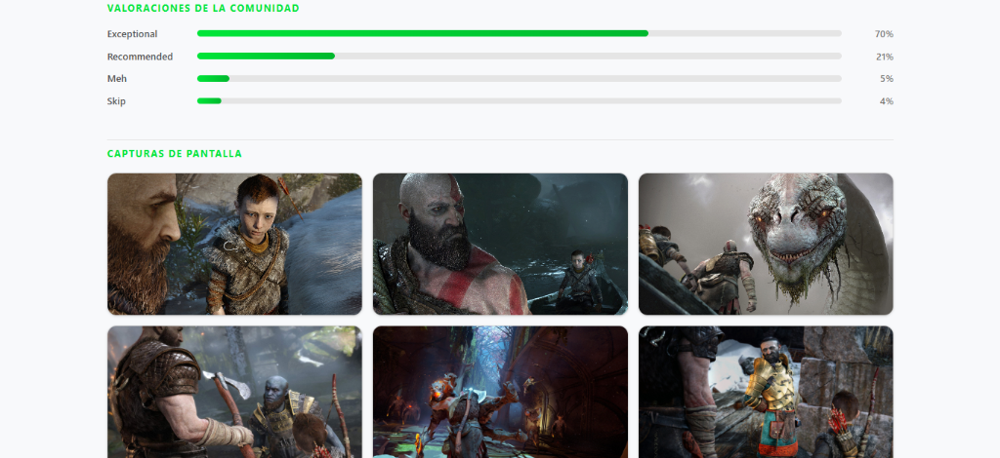

<<<<<<< HEAD
# GameBox
Proyecto personal para mostrar informacion de videojuegos con la API de RAWG
=======
# 🎮 GameBox

<div align="center">


**Explorador interactivo de videojuegos con catálogo dinámico, tráilers en tiempo real, filtros avanzados y traducción automática.**

[Ver Características](#-características-principales) • [Capturas](#-capturas-de-pantalla) • [Tecnologías](#-tecnologías-utilizadas) • [Instalación](#-instalación-y-puesta-en-marcha)

</div>

---

## 📖 Descripción del Proyecto

**GameBox** es una aplicación web moderna y reactiva diseñada para los apasionados de los videojuegos. Permite descubrir, buscar y explorar información detallada de miles de títulos impulsada por la API de [RAWG](https://rawg.io/).

La plataforma ofrece una experiencia inmersiva que incluye previsualización instantánea de tráilers al pasar el cursor por cada juego, sincronización bidireccional de filtros en la URL para compartir búsquedas, selector dinámico de tema claro/oscuro y traducción automática al español de las descripciones originales de los videojuegos.

---

## 📸 Capturas de Pantalla

### 1. Catálogo Principal y Carrusel de Categorías

> Exploración de títulos populares, destacados y novedades con carrusel deslizable horizontalmente y tarjetas interactivas.



---

### 2. Ficha Técnica de Detalle

> Banner ambiental inmersivo, puntuación oficial de Metacritic, calificación de la comunidad, plataformas compatibles y sinopsis traducida en tiempo real.



---

### 3. Valoraciones Comunitarias y Galería de Capturas

> Desglose porcentual de opiniones de jugadores y galería de imágenes con visor modal a pantalla completa (_Lightbox_).



---

## ✨ Características Principales

- **🔍 Buscador en tiempo real con Autocompletado:** Barra de búsqueda central con _debounce_ (300 ms), menú de sugerencias interactivo, contador de resultados y navegación completa por teclado (Flechas Arriba/Abajo, Enter y Escape).
- **🏷️ Sistema de Filtrado Multicriterio:**
  - **Categorías rápidas:** Populares, Mejor Valorados (Metacritic) y Novedades.
  - **Por Plataforma:** PlayStation, Xbox, PC, Nintendo Switch y Dispositivos Móviles.
  - **Por Género:** Acción, RPG / Rol, Shooters, Aventura, Estrategia, Carreras, Deportes, Lucha, Indie, Simulación, Puzles y Arcade.
  - **Filtros en URL:** Cada filtro se refleja en los parámetros de búsqueda (`?genre=...&platform=...&order=...`), facilitando compartir enlaces directamente.
- **🎬 Tráilers en Hover:** Reproducción automática de clips de vídeo al pasar el cursor sobre las tarjetas de juego sin recargar la página.
- **🌐 Traducción Automática al Español:** Las descripciones en inglés provistas por la API se traducen automáticamente al español mediante bloques optimizados, con opción de alternar entre el texto en español y el original.
- **⚡ Scroll Infinito Optimizado:** Carga progresiva de juegos conforme el usuario navega, implementada con la API nativa `IntersectionObserver` y control de peticiones con `AbortController`.
- **🌓 Modo Oscuro y Modo Claro:** Tema visual seleccionable con persistencia automática en el `localStorage` del navegador y adaptación de paletas de color de alto contraste.
- **🖼️ Visor de Capturas (_Lightbox_):** Modal a pantalla completa para visualizar las capturas de pantalla de los videojuegos en alta resolución.
- **🛡️ Seguridad y Sanitización:** Validación estricta de esquemas de URLs externas (`http:` / `https:`), codificación segura de parámetros para la API y limpieza de etiquetas HTML.

---

## 🛠️ Tecnologías Utilizadas

| Categoría                  | Tecnología / Librería                                        | Versión   | Propósito                                                                    |
| :------------------------- | :----------------------------------------------------------- | :-------- | :--------------------------------------------------------------------------- |
| **Frontend Core**          | [React](https://react.dev/)                                  | `^19.2.8` | Biblioteca principal para la interfaz declarativa basada en componentes      |
| **Entorno de Compilación** | [Vite](https://vite.dev/)                                    | `^8.2.2`  | Servidor de desarrollo ultra rápido y empaquetado optimizado para producción |
| **Enrutamiento**           | [React Router](https://reactrouter.com/)                     | `^7.18.3` | Enrutamiento del lado del cliente y sincronización de `useSearchParams`      |
| **Estilos & Diseño**       | [Tailwind CSS](https://tailwindcss.com/)                     | `^4.3.3`  | Framework de diseño utilitario de última generación con soporte dark mode    |
| **Plugin de Estilos**      | `@tailwindcss/vite`                                          | `^4.3.3`  | Integración nativa sin paso de compilación separado                          |
| **Componentes UI**         | [DaisyUI](https://daisyui.com/)                              | `^5.7.22` | Componentes de interfaz utilitarios                                          |
| **Iconografía & Fuentes**  | [Google Fonts & Material Symbols](https://fonts.google.com/) | CDN       | Tipografías _Inter_, _Montserrat_ e iconos vectoriales                       |
| **Linter**                 | [Oxlint](https://oxc.rs/)                                    | `^1.79.0` | Herramienta de análisis estático de código de alto rendimiento               |
| **API de Datos**           | [RAWG Video Games API](https://rawg.io/apidocs)              | v1        | Base de datos abierta de más de 500.000 videojuegos                          |
| **API de Traducción**      | Google Translate (GTX)                                       | REST      | Servicio de traducción automática de descripciones                           |

---

## 📁 Estructura del Proyecto

```text
GameBox/
├── public/
│   └── SVG/                    # Iconos vectoriales de plataformas, géneros y favicon
├── screenshots/                # Capturas de pantalla de la interfaz para documentación
│   ├── catalogo-home.png
│   ├── detalle-juego.png
│   └── valoraciones-capturas.png
├── src/
│   ├── assets/                 # Recursos gráficos estáticos
│   ├── components/
│   │   ├── CategoryCarousel.jsx # Carrusel horizontal de géneros y ordenamientos
│   │   ├── Description.jsx     # Ficha de detalle, sinopsis, valoraciones y capturas
│   │   ├── GameCard.jsx        # Tarjeta individual con tráiler interactivo
│   │   ├── Header.jsx          # Barra superior con buscador y cambio de tema
│   │   └── Sidebar.jsx         # Menú lateral desplegable de filtros
│   ├── context/
│   │   └── ThemeContext.jsx    # Contexto global para modo oscuro/claro
│   ├── utils/
│   │   └── security.js         # Utilidades de seguridad, codificación y limpieza HTML
│   ├── App.css                 # Estilos auxiliares
│   ├── App.jsx                 # Lógica de catálogo, filtros URL y rutas principales
│   ├── index.css               # Import de Tailwind CSS v4 y reseteo de scrollbars
│   └── main.jsx                # Punto de entrada y montaje de React DOM
├── index.html                  # Plantilla HTML con CSP y fuentes
├── package.json                # Dependencias y scripts del proyecto
├── vite.config.js              # Configuración de Vite con React y Tailwind v4
└── README.md                   # Documentación del proyecto
```

---

## 🚀 Instalación y Puesta en Marcha

Sigue estos pasos para ejecutar el proyecto de forma local:

### 1. Clonar el repositorio

```bash
git clone https://github.com/tu-usuario/GameBox.git
cd GameBox
```

### 2. Instalar dependencias

```bash
npm install
```

### 3. Configurar variables de entorno

Crea un archivo llamado `.env.local` en la raíz del proyecto y añade tu clave de API gratuita de [RAWG](https://rawg.io/apidocs):

```env
VITE_RAWG_API_KEY=tu_clave_de_rawg_aqui
```

> **Nota:** Puedes obtener una clave de API gratuita registrándote en [rawg.io/apidocs](https://rawg.io/apidocs).

### 4. Iniciar el servidor de desarrollo

```bash
npm run dev
```

Abre en tu navegador la URL que indique la terminal (generalmente `http://localhost:5173`).

### 5. Compilar para producción

Para generar los archivos optimizados para despliegue:

```bash
npm run build
```

Puedes previsualizar el bundle de producción con:

```bash
npm run preview
```

---

## 📄 Licencia

Distribuido bajo la Licencia MIT. Consulta el archivo `LICENSE` para más información.

---

<div align="center">
  Desarrollado con ❤️ usando <b>React 19</b> y <b>Tailwind CSS v4</b>
</div>
>>>>>>> 2de52a4 (The GameBox)
